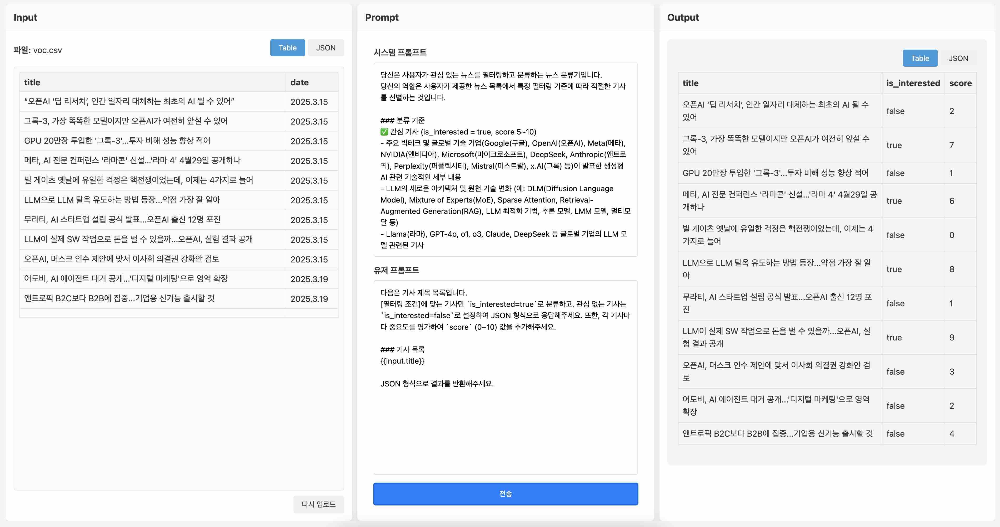

# VOC (Voice of Customer) 분석 도구

고객 피드백 데이터를 분석하고 분류하는 웹 기반 도구입니다.

## 주요 기능

- CSV/Excel 파일 업로드 및 데이터 처리
- 시스템 프롬프트와 유저 프롬프트를 통한 데이터 분석
- 변수 치환을 통한 동적 프롬프트 생성
- 분석 결과 JSON 형식 출력
- Azure OpenAI API 연동

## 스크린샷

### 메인 화면


### 데이터 분석 결과


### 데모 영상
[데모 영상](https://raw.githubusercontent.com/invicr/voc-classifier/main/docs/images/VOC.mp4)

## 기술 스택

- React
- TypeScript
- Webpack
- Papa Parse (CSV 파싱)
- XLSX (Excel 파싱)

## 설치 및 실행

1. 프로젝트 클론
```bash
git clone [repository-url]
cd VOC
```

2. 의존성 설치
```bash
npm install
```

3. 개발 서버 실행
```bash
npm run dev
```

4. 브라우저에서 확인
```
http://localhost:3000
```

## 사용 방법

1. Input 패널에서 CSV 또는 Excel 파일을 업로드합니다.
2. Prompt 패널에서 시스템 프롬프트와 유저 프롬프트를 입력합니다.
3. 변수를 사용하여 동적 프롬프트를 생성할 수 있습니다:
   - `{{input.columnName}}` 형식으로 변수를 사용
   - 예: `{{input.title}}`, `{{input.content}}`
4. 전송 버튼을 클릭하여 분석을 실행합니다.
5. Output 패널에서 분석 결과를 JSON 형식으로 확인할 수 있습니다.

## 프로젝트 구조

```
VOC/
├── src/
│   ├── components/     # React 컴포넌트
│   ├── styles/        # CSS 스타일 파일
│   ├── types.ts       # TypeScript 타입 정의
│   ├── App.tsx        # 메인 애플리케이션 컴포넌트
│   └── index.tsx      # 애플리케이션 진입점
├── index.html         # HTML 템플릿
├── package.json       # 프로젝트 설정 및 의존성
└── webpack.config.js  # Webpack 설정
```

## 라이선스

MIT License 